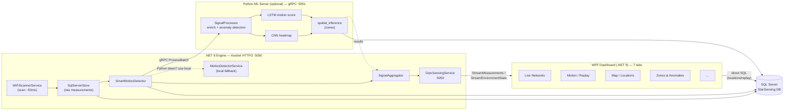

# STAR_SENSING

Wi-Fi **passive sensing** stack for Windows — scans nearby access points, runs ML on RSSI
fluctuations to detect motion, zones, and anomalies (no cameras), persists to SQL Server, and
visualizes everything in a WPF dashboard.

## How it works



- **Engine** (.NET 8, `Microsoft.NET.Sdk.Worker`, ManagedNativeWifi, Grpc.AspNetCore): scan loop,
  persistence, gRPC server. Runs standalone — Python is optional/best-effort.
- **Python** (optional, gRPC `:5051`): LSTM/CNN motion scores, spatial zone inference, anomaly
  detection. Engine falls back to its own rule-based `MotionDetectorService` if Python is down.
- **SQL Server** (`StarSensing` DB): single source of truth, schema auto-created on first run.
- **Dashboard** (WPF, .NET 9): 7 tabs, gRPC client to Engine + direct SQL for locations/replay.

Motion confidence is always `max(rule-based, LSTM×0.85, CNN×0.75)` — never a single model in isolation.

## Tech stack

| Layer | Stack |
|---|---|
| Engine | .NET 8, Grpc.AspNetCore 2.80, ManagedNativeWifi 3.0.2, Microsoft.Data.SqlClient 7.0 |
| Dashboard | .NET 9 (`net9.0-windows10.0.19041`), WPF, CommunityToolkit.Mvvm 8.4, ScottPlot.WPF, SkiaSharp.Views.WPF |
| Core | Shared lib (net8.0) — proto source of truth, models, interfaces |
| Python | 3.10+ (3.12 target), gRPC, TensorFlow-CPU/Keras (`.keras`), sklearn fallback, pyodbc |
| RPC | gRPC + Protobuf — `Core/Protos/star_sensing.proto` is the single source, regenerated for C# on build |
| DB | SQL Server (local/Express), schema created by Engine on first run |

## Folder structure

```
src/StarSensing.Core/        Protos/, Models/, Interfaces/  — shared, no business logic
src/StarSensing.Engine/      Services/, Workers/            — scan → store → process → publish
src/StarSensing.Dashboard/   Views/, ViewModels/, Services/, Models/, Themes/ — WPF, 7 tabs
src/StarSensing.Python/      *.py, models/ (.keras), protos/ — gRPC ML server + offline training
scripts/                     Setup, launch, purge PowerShell scripts + sql/
docs/                        MANUAL_MODEL_TRAINING.md
```

See [`PROJECT_GUIDE.md`](PROJECT_GUIDE.md) for the file-level map (feature → View/ViewModel/Service,
gRPC endpoints, DB tables) and [`CLAUDE.md`](CLAUDE.md) for conventions and constraints.

## Getting started

```powershell
# Full stack — preflight checks + setup + build + launch all 3 services
.\Start-StarSensing.ps1                 # add -SkipBuild / -NoPython / -SkipSetup as needed
```

Requires SQL Server (local/Express) and a `.env` (copy from `.env.example`) — see
[`SETUP_REQUIREMENTS.md`](SETUP_REQUIREMENTS.md).

Manual run (each service in its own terminal):

```powershell
dotnet run --project src/StarSensing.Engine
.\src\StarSensing.Python\venv\Scripts\python.exe .\src\StarSensing.Python\server.py
dotnet run --project src/StarSensing.Dashboard
```

## Database overview

| Table | Owner | Contents |
|---|---|---|
| `Measurements`, `AccessPoints` | Engine | Raw RSSI scans, AP metadata |
| `WiFi_Features` | Engine | Variance/entropy/motion confidence per batch+AP (training + replay) |
| `Motion_Events`, `Zone_State` | Engine | Detected motion events, spatial zone occupancy |
| `Locations`, `LocationSignals` | Dashboard | Named map snapshots + per-BSSID bearing/distance |
| `RouterBearings`, `MapSettings` | Dashboard | Persistent calibrated bearings, north offset |

No automated test suite — validate changes by running the stack and checking the relevant
Dashboard tab / Engine logs / SQL tables.
